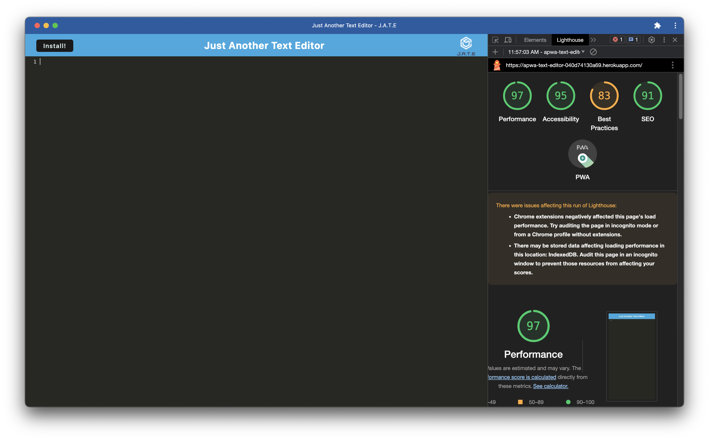

# Just Another Text Editor (J.A.T.E.)

J.A.T.E. is a simple web-based text editor with JavaScript syntax highlighting. It allows you to take notes, write code, and organize your thoughts effortlessly.



## Table of Contents
- [Features](#features)
- [Demo](#demo)
- [Getting Started](#getting-started)
  - [Prerequisites](#prerequisites)
  - [Installation](#installation)
- [Usage](#usage)
- [Built With](#built-with)
- [License](#license)

## Features

- JavaScript syntax highlighting.
- Easy note-taking and code writing.
- Simple and intuitive user interface.

## Demo

You can try out the live demo of J.A.T.E. [here](https://apwa-text-editor-040d74130a69.herokuapp.com/).

## Getting Started

These instructions will help you get a copy of the project up and running on your local machine for development and testing purposes.

### Prerequisites

Before you begin, ensure you have met the following requirements:

- Node.js and npm installed.

### Installation


1. Clone the repository:

  ```bash
  git clone https://github.com/EAnthonycarramza/PWA-Text-Editor.git
  cd PWA-Text-Editor
  ```
  2. install dependencies:
  ```bash
  npm install
  ```

### Usage

  1. Start the development server:
   ```bash
    npm start
   ```
  2. Open your web browser and navigate to http://localhost:3000 to access the text editor.

### Built With

  #### Express.js - Web framework for the server.
  
  #### Webpack - Module bundler for client-side code.
  
  #### CodeMirror - The JavaScript library for the text editor component.
  
  #### Workbox - Used for service worker and PWA functionality.

### License

This project is licensed under the MIT License.
